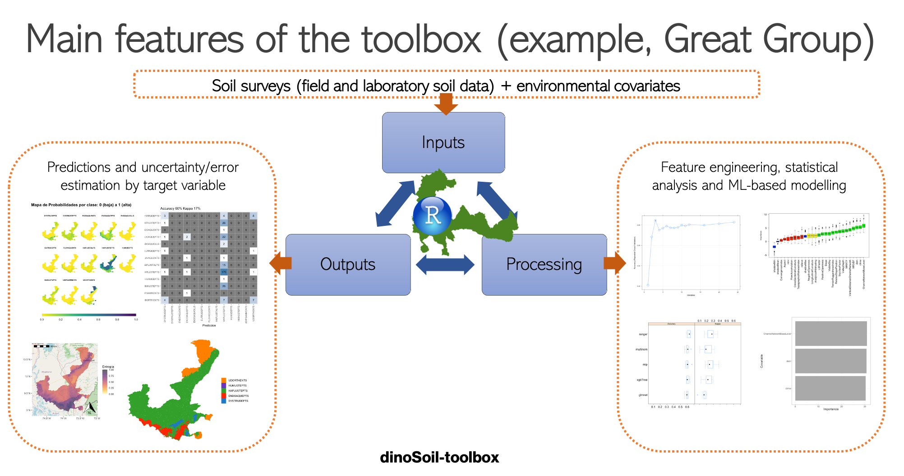
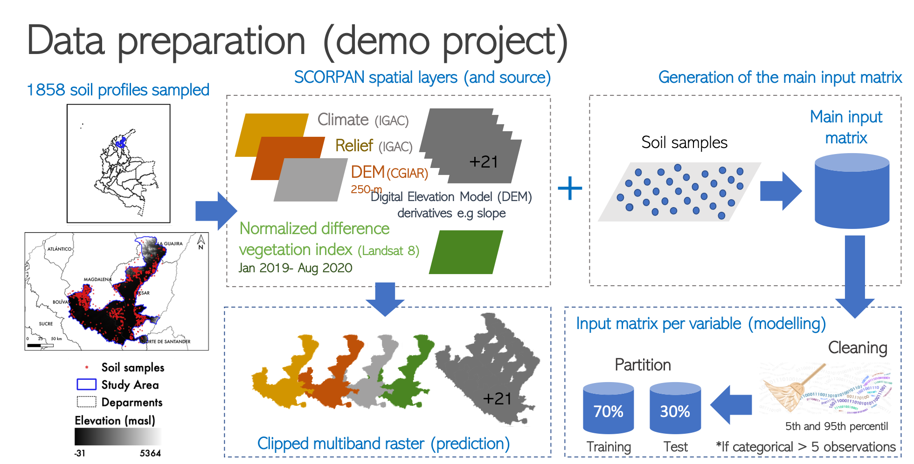

# dinoSoil-toolbox: Una herramienta para optimizar procesos de MDS de la Subdirección de Agrología

Herramienta (ver `src/dinoSOILtoolbox.R`) basada en tecnología de la información para ejecutar y optimizar procesos para le mapeo digital de suelos (MDS).

Si usted usa esta herramienta por favor citar:

Se incluye un archivo ZIP con un proyecto ejemplo (ver `proyecto_cesarmagdalena.zip`) dentro del repositorio para ejecutar y probar las funciones de la herramienta.

Este archivo se puede descargar mediante el archivo bash (`descarga.sh`)

```bash
bash descarga.sh
```

Alternativamente se puede descargar de la dirección:
```bash
https://github.com/acocac/dinoSOIL-toolbox/blob/master/proyecto_cesarmagdalena.zip
```

## Documentación
Un manual paso a paso se deja en repositorio (ver `ManualUsuario_V01.pdf`) disponible para la version 0.1. 

## Agradecimientos
El equipo de la Oficina CIAF agradece a la Subdirección de Agrología del Instituto Geográfico Agustín Codazzi (IGAC)  por su constante apoyo y validación de la herramienta. Igualmente, los desarrollos construidos son basados en ejercicios previos de la Subdirección distribuidos mediante la cooperación del proyecto I+D+i entre la Subdirección de Agrología y Oficina CIAF.

## Contribuciones
Contribuciones pueden hacerse mediante peticiones en la pestaña Pull del repositorio en GitHub. 

## Trabajo futuro
- Ejemplos de implementaciones sugeridas basados en otros desarrollos se dejan al final del código principal (ver `src/dinoSOILtoolbox.R`).
- Generar una interfaz gráfica de la herramienta
- Documentar la herramienta en el idioma inglés

## Resumen del funcionamiento de la herramienta
Esquema de las funcionalidades de la herramienta:
<p align="center">

</p>

Esquema de las funcionalidades de la herramienta:
<p align="center">

</p>